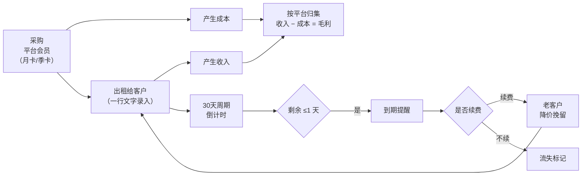
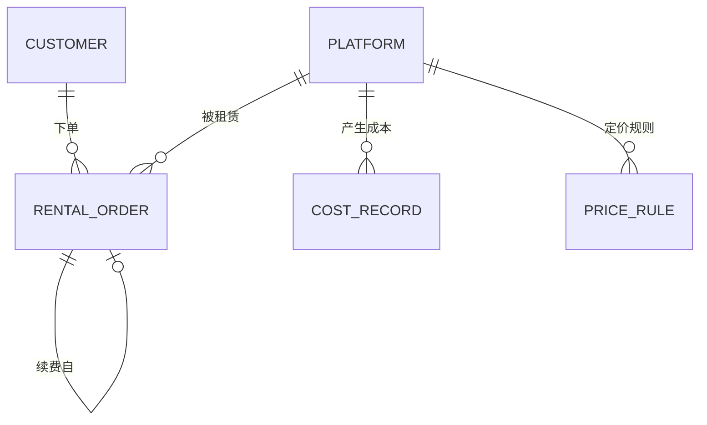

# HHStudio Junye 会员管理系统 · 产品需求文档（PRD）

| 项目 | 内容 |
|---|---|
| 产品名称 | HHStudio Junye 会员管理系统 |
| 文档版本 | v1.0 |
| 编写日期 | 2026-08-02 |
| 状态 | 待审核 |
| 目标用户 | 平台运营者本人（单用户系统） |

---

## 1. 项目背景与目标

### 1.1 背景

运营者持有爱奇艺、腾讯视频、哔哩哔哩、芒果TV、优酷五大平台的视频会员（月卡 / 季卡）。由于单人无法用满全部权益，将闲置的会员使用权对外出租，从中赚取差价。

目前的痛点：

| 痛点 | 现状 | 后果 |
|---|---|---|
| 记录靠人脑 / 记事本 | 订单散落在聊天记录里 | 到期忘记提醒，客户流失 |
| 到期时间算不清 | 每单 30 天，起始日各不相同 | 需要手工推算，容易错 |
| 不知道谁是优质客户 | 没有累计数据 | 无法差异化维护和定价 |
| 算不清真实赚了多少 | 收入分散、成本零散 | 只知流水，不知毛利 |
| 录入成本高 | 每单要填一堆表单字段 | 懒得记，数据不全 |

### 1.2 产品目标

**一句话目标：把一行文字变成一门算得清账的生意。**

1. **降本**：把每单录入时间压到 5 秒以内（一行文字 → 结构化记录），成本可归集、可核算。
2. **增效**：到期不漏提醒，续费率提升；识别优质客户并差异化定价，把新客转化为老客。
3. **看得清**：任意时点都能回答「本周/本月/今年，哪个平台赚了多少、亏了多少」。

### 1.3 核心成功指标

| 指标 | 目标 |
|---|---|
| 单笔订单录入耗时 | ≤ 5 秒 |
| 文本解析字段准确率 | ≥ 95%（平台/日期/价格） |
| 到期漏提醒次数 | 0 |
| 老客续费率（第 2 月起） | 可量化并逐月观测 |

---

## 2. 业务模型梳理

### 2.1 角色

系统为**单用户系统**，只有运营者本人登录使用。客户（租户）不登录，仅作为数据对象存在。

### 2.2 核心业务链路



### 2.3 盈利公式

```
单平台毛利 = Σ(该平台所有租赁订单收入) − Σ(该平台会员采购成本)
总毛利     = Σ(各平台毛利)
毛利率     = 毛利 / 总收入
```

> **⚠️ 关键业务点（需确认，见 §11-Q1）**
> 收入按**订单（租户）**计量，成本按**平台账号**计量。一个平台账号通常可同时供多台设备使用，也就是「一份成本 → 多份收入」。因此**平台维度的毛利才是真实毛利，单笔订单的毛利没有意义**。本 PRD 的所有利润统计一律以**平台**为最小核算单位。

### 2.4 定价策略模型

运营者的核心增长策略是：**用原价吸引新客 → 第二个月起降价 → 转化为长期老客**。

| 客户状态 | 定义 | 定价 |
|---|---|---|
| 新客户（NEW） | 该平台历史订单数 = 0 | 首月标准价（如爱奇艺 13 元） |
| 老客户（RETURNING） | 该平台历史订单数 ≥ 1 | 续费优惠价（如爱奇艺 11 元） |

系统在录入订单时**自动判定新老客身份并给出建议价格**，实收价与建议价不一致时提示但不阻断（允许人工议价）。

---

## 3. 范围定义

### 3.1 MVP（一期，本次交付）

- ✅ 自然语言文本录入 + 智能解析 + 确认卡片
- ✅ 月卡 30 天周期管理 + 自定义剩余时长
- ✅ 到期提醒（登录首页即将到期列表）
- ✅ 客户档案 + 优质用户评分与分层
- ✅ 新老客自动判定 + 建议价格
- ✅ 成本录入（表单 + 文本两种方式）
- ✅ 周 / 月 / 年收益统计，按平台分类
- ✅ 数据看板 + 图表
- ✅ 每日自动更新统计
- ✅ 密码登录 + 自有服务器部署

### 3.2 二期（P1，本次不做但数据模型预留）

- 平台账号资源池管理（账号 ↔ 设备位 ↔ 租户绑定）
- 日卡 / 自定义天数卡种（`durationType` 字段已预留）
- 微信 / 邮件 / Server酱 到期推送
- 成本按权责发生制跨月摊销（现金口径已满足 MVP）
- 客户联系方式与聊天记录归档
- 退款 / 中途退租处理

### 3.3 明确不做

- 客户端登录 / 自助下单
- 在线支付
- 多租户 / 多运营者协作

---

## 4. 核心概念与数据模型

### 4.1 实体关系



### 4.2 数据表设计

#### `platform` 平台

| 字段 | 类型 | 说明 |
|---|---|---|
| id | TEXT PK | `iqiyi` / `tencent` / `bilibili` / `mango` / `youku` |
| name | TEXT | 显示名：爱奇艺 |
| aliases | TEXT | 解析别名，逗号分隔：`奇艺,爱奇艺,iqiyi,IQIYI` |
| colorSlot | INT | 图表配色槽位 1–5 |
| sortOrder | INT | 排序 |
| active | INT | 是否启用 |

#### `customer` 客户

| 字段 | 类型 | 说明 |
|---|---|---|
| id | TEXT PK | UUID |
| name | TEXT | 姓名 / 昵称，如「小陈」 |
| note | TEXT | 备注（自由文本，累积用于识别客户特征） |
| region | TEXT | 最近一次地区，如「浙江杭州」 |
| device | TEXT | 最近一次设备，如「iPhone17」 |
| firstOrderAt | INT | 首单时间戳 |
| lastOrderAt | INT | 末单时间戳 |
| totalOrders | INT | 累计订单数（派生，每日刷新） |
| totalRevenue | REAL | 累计消费金额（派生） |
| renewalCount | INT | 续费次数（派生） |
| score | INT | 优质度评分 0–100（派生） |
| tier | TEXT | 分层：`diamond`/`gold`/`silver`/`normal`/`new` |
| createdAt / updatedAt | INT | 时间戳 |

#### `rental_order` 租赁订单（核心表）

| 字段 | 类型 | 说明 |
|---|---|---|
| id | TEXT PK | UUID |
| customerId | TEXT FK | 客户 |
| platformId | TEXT FK | 平台 |
| price | REAL | 实收价格（元） |
| startDate | TEXT | 生效日 `YYYY-MM-DD` |
| durationDays | INT | 有效天数，默认 30，支持自定义 |
| endDate | TEXT | 到期日（= startDate + durationDays，落库冗余便于查询） |
| durationType | TEXT | `month`(30) / `quarter`(90) / `day`(1) / `custom` — **为日卡预留** |
| customerType | TEXT | 下单时身份：`new` / `returning` |
| device | TEXT | 使用设备，如「iPhone17」 |
| region | TEXT | 地区，如「浙江杭州」 |
| note | TEXT | 备注 |
| suggestedPrice | REAL | 系统建议价（留痕，用于分析议价空间） |
| renewedFromId | TEXT FK NULL | 续费自哪张订单 |
| accountId | TEXT NULL | **P1 预留**：绑定的平台账号 |
| rawText | TEXT | 原始录入文字（留痕，可回溯解析错误） |
| createdAt / updatedAt | INT | 时间戳 |

**订单状态为派生值，不落库**（保证任意时刻都准确）：

| 状态 | 条件 | 颜色 |
|---|---|---|
| `active` 生效中 | 剩余天数 > 3 | 绿 |
| `expiring_soon` 临期 | 1 < 剩余天数 ≤ 3 | 橙 |
| `expiring` 即将到期 | 0 ≤ 剩余天数 ≤ 1 | 红（**触发提醒**） |
| `expired` 已过期 | 剩余天数 < 0 | 灰 |

> 剩余天数 = `endDate` − 今天（按自然日计算，不含时分秒）。

#### `cost_record` 成本记录

| 字段 | 类型 | 说明 |
|---|---|---|
| id | TEXT PK | UUID |
| platformId | TEXT FK | 归属平台 |
| amount | REAL | 金额（元） |
| costDate | TEXT | 发生日 `YYYY-MM-DD` |
| periodDays | INT | 覆盖周期天数（月卡 30 / 季卡 90），用于 P1 摊销 |
| category | TEXT | `membership`（会员采购）/ `other`（其他） |
| note | TEXT | 备注，如「8月月卡续费」 |
| rawText | TEXT | 原始录入文字 |
| createdAt | INT | 时间戳 |

#### `price_rule` 定价规则

| 字段 | 类型 | 说明 |
|---|---|---|
| id | TEXT PK | UUID |
| platformId | TEXT FK | 平台 |
| customerType | TEXT | `new` / `returning` |
| price | REAL | 建议价 |

#### `daily_snapshot` 每日快照

| 字段 | 类型 | 说明 |
|---|---|---|
| date | TEXT PK | `YYYY-MM-DD` |
| activeOrders | INT | 当日在租订单数 |
| revenue | REAL | 当日新增收入 |
| cost | REAL | 当日新增成本 |
| payload | TEXT | JSON，平台维度明细 |

#### `app_setting` 系统设置

键值表：登录密码哈希、默认周期天数、提醒阈值天数、成本口径开关等。

---

## 5. 功能需求详述

### F1 · 自然语言文本录入（核心交互）

> **这是整个系统的入口，决定了系统好不好用。**

#### F1.1 输入形态

首页顶部常驻一个大输入框，支持**单行**或**多行批量**（每行一单）粘贴：

```
小陈 爱奇艺 2026.8.02 13 老顾客（一直很守时） iphone17 浙江杭州
小李 腾讯 2026.8.02 15 新顾客 华为mate70 广东深圳
```

#### F1.2 解析规则（顺序无关，按特征识别）

| 字段 | 识别方式 | 示例 |
|---|---|---|
| **平台** | 别名词典匹配 | `爱奇艺`/`奇艺`/`iqiyi`；`腾讯`/`腾讯视频`；`b站`/`哔哩哔哩`/`bilibili`；`芒果`/`芒果TV`；`优酷`/`youku` |
| **日期** | 多格式正则 | `2026.8.02`、`2026-08-02`、`2026/8/2`、`8.2`（补当前年）、`今天`、`昨天`、`明天` |
| **价格** | 纯数字或数字+单位，范围 0–9999 | `13`、`13元`、`13块` |
| **客户名** | 剩余中文/字母词，排除已匹配项 | `小陈` |
| **新老客** | 关键词 | `新顾客`/`新客`→NEW；`老顾客`/`老客`/`回头客`→RETURNING；**不填则由系统按历史自动判定** |
| **设备** | 设备词典 + 型号 | `iphone17`、`华为mate70`、`小米15`、`ipad`、`电视`/`TV`、`平板`、`电脑`/`PC`/`Mac` |
| **地区** | 省市词典 | `浙江杭州`、`广东深圳`、`杭州` |
| **备注** | 中英文括号内容，或 `备注:` 之后 | `（一直很守时）` |
| **时长** | 关键词 | `月卡`→30；`季卡`→90；`30天`；`剩余15天`→15；`到期2026.8.20`→按日期反推 |

**冲突消解**：日期优先于价格识别（`8.2` 先判日期），已被平台/设备/地区消费的词不再参与客户名匹配。

#### F1.3 确认卡片（防脏数据的关键环节）

解析后**不直接入库**，先渲染一张可编辑的确认卡片：

- 已识别字段正常显示，可点击修改
- 未识别的**必填**字段（客户名 / 平台 / 价格 / 开始日期）标红高亮，必须补全才能保存
- 自动计算并显示：到期日、剩余天数
- 若识别到已有客户，显示身份徽标：`老客户 · 该平台第 3 单 · 累计 39 元`
- 显示**建议价格**与实收价差额：`建议 11 元，实收 13 元（+2）`
- 多行录入时逐条排列，可整体保存或单条剔除

#### F1.4 同名客户处理

保存时若命中同名客户，弹出确认：

> 已存在客户「小陈」（爱奇艺 3 单，累计 39 元，浙江杭州）
> ○ 是同一人，合并到该客户　　○ 是新客户，单独建档

---

### F2 · 周期与到期管理

| 需求 | 实现 |
|---|---|
| 月卡 30 天 | 默认 `durationDays = 30`，`endDate = startDate + 30 天` |
| 季卡 90 天 | 录入「季卡」自动置 90 |
| **自定义剩余时长** | 录入时写 `剩余15天`，或在确认卡片 / 订单详情直接改「有效天数」或「到期日」，二者联动 |
| 日卡 | 数据模型已支持（`durationType='day'`），MVP 界面不开放 |
| 每日自动更新 | 剩余天数为**实时派生计算**，任何时刻查询都准确；每日 00:05 定时任务额外生成当日快照与提醒 |

### F3 · 到期提醒

- **触发条件**：剩余天数 ≤ 1 天（含当天到期、明天到期）
- **展示位置**：
  1. 登录后首页看板**顶部醒目提醒区**（红色卡片），列出：客户名 / 平台 / 到期日 / 剩余天数 / 上次价格 / 客户分层 / 备注
  2. 侧边栏「订单」菜单右侧红色数字角标
- **一键续费**：提醒列表每行提供「续费」按钮，自动带入上次的客户、平台、设备、地区，起始日 = 上次到期日，价格 = **老客建议价**，一键生成新订单并回写 `renewedFromId`
- 分级预警：≤1 天红色，≤3 天橙色（次级提示区）

### F4 · 客户档案与优质用户识别

#### F4.1 评分模型（0–100 分）

| 维度 | 权重 | 计算方式 |
|---|---|---|
| 累计消费金额 | 30% | 相对全体客户分位数 |
| 续费次数 | 25% | 续费单数 / 总单数 |
| 连续在租时长 | 20% | 首单至今覆盖的天数占比 |
| 按时续费率 | 15% | 到期 3 天内完成续费的比例 |
| 跨平台数 | 10% | 订阅平台数 / 5 |

#### F4.2 客户分层

| 分层 | 分数 | 建议动作 |
|---|---|---|
| 💎 钻石 | ≥ 80 | 赠送额外时长 / 优先保障优质账号 |
| 🥇 金牌 | 60–79 | 续费再降价 |
| 🥈 银牌 | 40–59 | 到期主动触达 |
| ⚪ 普通 | < 40 | 常规维护 |
| 🆕 新客 | 首单未满 30 天 | 引导续费，主推「第二月降价」 |

#### F4.3 自动标签

`老客户`（≥2 单）、`跨平台`（≥2 平台）、`高频`（≥4 单）、`流失风险`（到期未续 3–14 天）、`已流失`（到期未续 > 30 天）、`大额`（累计消费 Top 20%）

#### F4.4 客户详情页

基础信息、评分雷达、订单时间轴、消费趋势、备注编辑（历史备注累积展示，供人工判断）。

### F5 · 定价策略

- 设置页维护「平台 × 新老客 → 建议价」价格表，预置默认值可改
- 录入订单时按客户在**该平台**的历史订单数自动判定新老客并带出建议价
- 记录 `suggestedPrice` 与 `price` 差额，报表中可查看「议价损益」
- 报表中展示**新客转化率**：首单客户中，在 60 天内产生第 2 单的比例

### F6 · 成本管理

#### F6.1 两种录入方式

1. **表单录入**：平台 + 金额 + 发生日期 + 周期天数 + 分类 + 备注
2. **文本录入**（与订单同款输入框，自动识别为成本）：
   ```
   成本 爱奇艺 2026.8.1 30 月卡续费
   爱奇艺 8月 花费30元
   ```
   以 `成本` / `花费` / `续费` / `采购` 等关键词触发成本解析分支。

#### F6.2 成本口径

- **MVP 采用现金口径**：成本全额计入 `costDate` 所在期间。直观、对账简单。
- P1 提供「按周期摊销」开关：季卡 60 元 / 90 天 → 每天 0.67 元分摊到覆盖月份，利润曲线更平滑。

#### F6.3 成本视图

按平台 × 月份的矩阵表，一眼看出每个平台每月投入多少。

### F7 · 收益统计与报表

#### F7.1 统计口径

| 周期 | 定义 |
|---|---|
| 周 | 周一 00:00 – 周日 23:59 |
| 月 | 自然月 |
| 年 | 自然年 |

收入按订单 `startDate` 计入，成本按 `costDate` 计入。

#### F7.2 报表内容

**核心指标行**：总收入 / 总成本 / 毛利 / 毛利率 / 订单数 / 活跃客户数（含环比）

**平台明细表**（核心，按平台大类清晰列出）：

| 平台 | 订单数 | 收入 | 成本 | 毛利 | 毛利率 |
|---|---|---|---|---|---|
| 爱奇艺 | 12 | 156.0 | 30.0 | 126.0 | 80.8% |
| 腾讯视频 | 9 | 135.0 | 25.0 | 110.0 | 81.5% |
| … | | | | | |
| **合计** | **—** | **—** | **—** | **—** | **—** |

**图表**：
- 收入 / 成本 / 毛利 趋势折线（按周或月）
- 各平台收入堆叠柱状图
- 平台毛利对比条形图

**经营洞察**：新增客户数、续费单数与续费率、流失客户、到期未续清单、TOP 5 客户。

#### F7.3 导出

周报 / 月报支持导出为 Markdown 文本（便于直接复制发送）与 CSV。

### F8 · 数据看板（首页）

自上而下：

1. **文本录入框**（常驻，最高优先级）
2. **到期提醒区**（有临期订单时才出现，红色）
3. **KPI 指标卡**：本月收入 / 本月成本 / 本月毛利 / 在租订单 / 活跃客户
4. **近 30 天收入趋势图**
5. **各平台本月盈亏对比**
6. **最近订单列表**

### F9 · 每日自动任务

每日 00:05 执行：

1. 重算全部客户的累计指标、评分、分层、标签
2. 生成当日到期提醒清单
3. 写入 `daily_snapshot` 当日快照
4. 数据库自动备份（保留最近 30 份）

触发方式：应用内置调度器（进程常驻）+ 对外暴露受 token 保护的 `/api/cron/daily`，可由服务器 crontab 调用作为兜底。

### F10 · 登录与安全

- 单用户密码登录，密码经 scrypt 哈希存储于数据库
- 登录态为 HttpOnly + SameSite=Lax 签名 Cookie，有效期 30 天
- 中间件拦截所有非 `/login` 路由
- 首次启动引导设置密码

---

## 6. 页面结构

```
├── /login                登录
├── /                     数据看板（含文本录入）
├── /orders               订单管理（筛选/排序/编辑/续费）
├── /customers            客户列表（评分/分层/标签筛选）
├── /customers/[id]       客户详情
├── /costs                成本管理
├── /reports              报表（周/月/年切换）
└── /settings             设置（平台、价格规则、密码、系统参数）
```

左侧固定侧边栏 + 右侧内容区，移动端侧边栏收起为底部导航（方便随手在手机上查到期列表）。

---

## 7. UI 设计规范

### 7.1 设计原则

**清晰 > 好看**。信息密度适中，关键数字大字号，状态用颜色 + 文字双重编码（不依赖颜色单独传递信息）。

### 7.2 主色板（黄棕 / 淡棕色系）

| 角色 | 浅色模式 | 深色模式 | 用途 |
|---|---|---|---|
| 主色 Primary | `#8B5E34` | `#C89361` | 主按钮、选中态、强调 |
| 主色深 | `#6F4A28` | `#A9784C` | Hover |
| 焦糖 Secondary | `#C89361` | `#8B5E34` | 次级按钮、标签 |
| 琥珀 Accent | `#E0A03C` | `#E0A03C` | 高亮、徽标 |
| 页面底色 | `#FAF5EC` | `#141210` | 页面背景 |
| 卡片面 | `#FDFAF4` | `#1A1613` | 卡片 / 图表底 |
| 描边 | `#E7D8C1` | `#332B23` | 分隔线、边框 |
| 主文字 | `#2E2318` | `#F5EFE6` | 正文 |
| 次文字 | `#75634F` | `#B8A894` | 辅助说明 |
| 弱文字 | `#A2907B` | `#8A7A68` | 轴标签 |

### 7.3 状态色（固定语义，始终配文字/图标，不单独用颜色表意）

| 状态 | 色值 | 含义 |
|---|---|---|
| 良好 good | `#0CA30C` | 生效中、毛利为正 |
| 警告 warning | `#FAB219` | 3 天内到期 |
| 严重 serious | `#EC835A` | 1 天内到期 |
| 危险 critical | `#D03B3B` | 已过期、亏损 |

### 7.4 图表配色（平台身份色）

平台是**分类型（categorical）身份**编码，采用经校验的固定槽位配色，**顺序固定、不循环、不因筛选而重排**：

| 槽位 | 平台 | 浅色 | 深色 |
|---|---|---|---|
| 1 | 爱奇艺 | `#2A78D6` | `#3987E5` |
| 2 | 腾讯视频 | `#EB6834` | `#D95926` |
| 3 | 哔哩哔哩 | `#1BAF7A` | `#199E70` |
| 4 | 芒果TV | `#EDA100` | `#C98500` |
| 5 | 优酷 | `#E87BA4` | `#D55181` |

> 该组合已用色觉障碍模拟校验：浅色模式最差相邻对 CVD ΔE 9.1、常规视觉 ΔE 19.6；深色模式 8.4 / 19.3，均通过。浅色模式下 3 个槽位对底色对比度低于 3:1，**因此图表必须同时提供图例 + 数值直接标注**（已在规范中强制），保证不依赖颜色也能读数。

### 7.5 字体与数字

- 字体：`system-ui, -apple-system, "PingFang SC", "Microsoft YaHei", sans-serif`
- 表格列与坐标轴刻度使用 `font-variant-numeric: tabular-nums` 保证纵向对齐
- 金额统一保留 2 位小数，前缀 `¥`

### 7.6 图表规范

- 细描边：线宽 2px，数据端 4px 圆角，堆叠段之间留 2px 底色缝隙
- 网格线极淡（`#E7D8C1` 级别），坐标轴不喧宾夺主
- ≥2 个系列必须有图例；≤4 个系列同时直接标注数值
- 悬停显示十字准星 + 数据浮层
- **单一纵轴**，绝不使用双轴
- 提供「表格视图」切换，保证可访问性

---

## 8. 技术方案

### 8.1 技术选型

| 层 | 选型 | 理由 |
|---|---|---|
| 框架 | **Next.js 16（App Router）+ React 19** | 当前最新稳定版；SSR 首屏快；单进程即可自托管 |
| 语言 | **TypeScript 5** | 类型安全 |
| 样式 | **Tailwind CSS v4** | 零运行时，主题令牌集中管理 |
| 数据库 | **SQLite（better-sqlite3）** | 单文件、零外部依赖、备份=复制文件，最适合单用户自托管 |
| ORM | **Drizzle ORM** | 轻量、类型安全、迁移可控 |
| 图表 | **手写 SVG 组件** | 无第三方图表库，包体小、配色完全可控 |
| 鉴权 | 自实现 scrypt + 签名 Cookie | 无需外部服务 |
| 部署 | `output: 'standalone'` + Docker | 一条命令跑起来 |

**不引入**：Redis、Postgres、外部鉴权服务、图表库、组件库 —— 保持轻量，降低自托管运维成本。

### 8.2 部署形态（面向自有云服务器）

```bash
# 方式一：Docker（推荐）
docker compose up -d

# 方式二：裸机 Node
npm ci && npm run build
node .next/standalone/server.js
```

- 数据持久化：整个数据库就是 `data/app.db` 一个文件，映射为 Docker volume
- 备份：`cp data/app.db backup/` 即可，系统亦每日自动备份
- 资源需求：512MB 内存足够
- 反向代理：Nginx / Caddy 配 HTTPS

### 8.3 非功能需求

| 项 | 要求 |
|---|---|
| 性能 | 页面响应 < 300ms（年数据量约千级订单，SQLite 完全胜任） |
| 可用性 | 单机部署，进程守护自动重启 |
| 数据安全 | 密码哈希存储；每日自动备份保留 30 份 |
| 响应式 | 桌面为主，手机可查看看板与到期列表 |
| 时区 | 统一 `Asia/Shanghai`，日期按自然日计算 |

---

## 9. 验收标准（关键用例）

| # | 用例 | 预期 |
|---|---|---|
| 1 | 输入 `小陈 爱奇艺 2026.8.02 13 老顾客（备注） iphone17 浙江杭州` | 7 个字段全部正确解析，到期日显示 2026-09-01 |
| 2 | 同一客户第 2 次下单同平台 | 自动判定为老客户，带出续费优惠价 |
| 3 | 订单剩余 1 天 | 登录首页顶部出现红色提醒，侧边栏出现角标 |
| 4 | 手动把某订单有效天数改为 15 天 | 到期日与剩余天数同步更新 |
| 5 | 录入 `成本 爱奇艺 2026.8.1 30 月卡续费` | 生成爱奇艺成本记录 30 元 |
| 6 | 打开月报 | 平台明细表各平台收入−成本=毛利，合计行与 KPI 卡一致 |
| 7 | 一键续费 | 新订单起始日 = 原订单到期日，且关联 `renewedFromId` |
| 8 | 跨零点后刷新 | 所有剩余天数自动 −1，无需人工操作 |

---

## 10. 里程碑

| 阶段 | 内容 |
|---|---|
| M1 | 项目骨架、主题、数据库、文本解析引擎 |
| M2 | 订单管理、周期计算、到期提醒、看板 |
| M3 | 客户分层、定价建议、成本管理 |
| M4 | 报表、图表、导出、每日任务、部署配置 |

---

## 11. 待确认问题（需您决策）

| # | 问题 | 我的建议 |
|---|---|---|
| **Q1** | 一个平台账号是否同时租给多人（多设备位）？是否需要「账号池」管理每个账号租了几个位、账号密码是什么？ | **建议二期做**。MVP 先按平台维度算账，不影响利润准确性；但如果您经常需要查「这个客户用的是哪个账号」，可以提前到一期 |
| **Q2** | 成本口径：季卡 60 元是全额计入购买当月（现金口径），还是按天摊到 3 个月（权责口径）？ | **建议 MVP 用现金口径**，简单直观；二期加开关 |
| **Q3** | 收入是否需要跨月摊分？（8/2 的月卡覆盖到 9/1） | **建议不摊**，按下单日全额计入当月，与您的实际收款一致 |
| **Q4** | 是否需要记录客户联系方式（微信号/平台订单号）？ | 建议先用「备注」承载，二期再独立字段 |
| **Q5** | 到期提醒除了登录时看，是否需要微信/邮件推送？ | 二期可加 Server酱 / 邮件，一期先做站内 |
| **Q6** | 各平台新客价 / 老客价的具体数值？ | 先预置一版默认值，您在设置页随时改 |
| **Q7** | 中途退租 / 退款如何处理？ | 建议二期支持，一期可直接编辑或删除订单 |

---

## 12. 附：默认预置数据

**平台**：爱奇艺、腾讯视频、哔哩哔哩、芒果TV、优酷

**默认价格规则**（可在设置页修改）：

| 平台 | 新客首月 | 老客续费 |
|---|---|---|
| 爱奇艺 | 13 | 11 |
| 腾讯视频 | 15 | 13 |
| 哔哩哔哩 | 12 | 10 |
| 芒果TV | 10 | 8 |
| 优酷 | 12 | 10 |

**系统参数**：默认周期 30 天 · 提醒阈值 1 天 · 次级预警 3 天 · 时区 Asia/Shanghai
